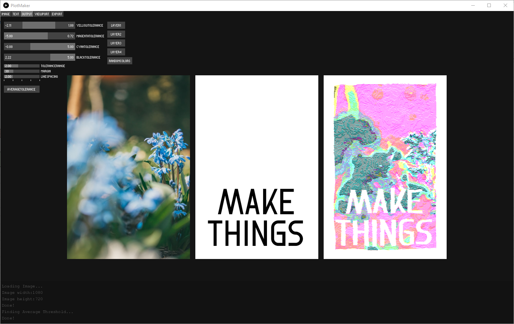
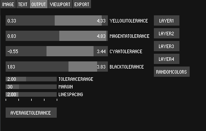
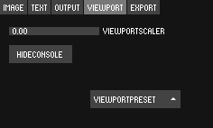
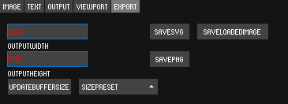

# PlotMaker MKII



PlotMaker MK2 is a processing application I created that allows the user to take advantage of the generative power of their computer. The application reads image data and displaces a predetermined set of lines to “draw” the image onto 4 separate CMYK layers. But the real power comes in the abstraction of the original form through this process.

Images can be sourced from Unsplash.com directly or the user can drag and drop their own into the window. With variable resizing of the output, any specific sizing can be generated using just a few clicks.
The application also adds elements of randomness and noise to the final output to create a remix of the original image.

This final output can be exported and plotted using a pen plotter such as the iDraw or the Axidraw easily because of the spliced layer output.

## Requirements 
```bash
import processing.svg.*;
import de.ixdhof.hershey.*;
import controlP5.*;
import drop.*;
import milchreis.imageprocessing.*;
import milchreis.imageprocessing.utils.*;
import at.mukprojects.console.*;
```
The sketch needs the processing SVG library, HersheyText library, ControlP5 library, the Drop library, The Image Processing Algorithms library, and the Console library. All are available within the native processing library manager. Install before use and then run!

## Usage
### Frame 1


The IMAGE UI controls the image used to displace the lines in the final output. The unsplash keyword is the search term used to source images from unsplash. NEWIMAGE gets a new image from unsplash. The image will automatically fit to the window but if you resize it, FITIMAGE will return it to its best size. IMAGEXPOS and IMAGEYPOS allow you to move the image in the window. IMAGESCALE allows you to zoom in and out, however, edges of the image may be visible. EXPOSURE raises and lowers the overall brightness of the image. CONTRAST raises and lowers the contrast. CONTRAST is destructive unfortunatly so raising it and then lowering it doesnt return to exactly the same visual quality of the original image.

### Frame 2


The TEXT UI controls the the text added to create a knockout effect in the final output. TEXTXPOS and TEXTYPOS allow you to move the text around. TEXTROTATION allows you to rotate the text and it snaps to 40 degree incriments. LEADING increases or decreases line spacing. TEXTBOXWIDTHOFFSET allows you to decrease the width of the text box so you can force multiple lines of text. INPUT is the input box for text input. FONTSELECTION allows you to change the font of the text.

### Output


The OUTPUT UI controls the parameters on which the lines drawn to the final image operate. This is where the fun is. YELLOWTOLERANCE, MAGENTATOLERANCE, CYANTOLERANCE,BLACKTOLERANCE control the tolerance range between which lines are drawn on their respective color layers. each layer only samples the underlying color of the pixels in their color space. TOLERANCERANGE is the range above and below the average tolerance that is sampled. MARGIN is the white space around the drawn image. LINESPACING is how closly the line are drawn to eachother (anything less than two will severly slow down the program, it still works but be patient.) LAYER1, LAYER2, LAYER3, LAYER4 open a color picker that lets you change the color of that layer. RANDOMCOLOR generates random colors for each layer.

### Viewport


The VIEWPORT section allows you to changes the size and scope of the panels found in the window. VIEWPORTSCALER will zoom in an out on each frame. This setting will automatically resize to fit the canvas in the window. HIDECONSOLE will hide the terminal window at the bottom of the screen. VIEWPORTPRESET allows you to see 1 specific frame or all 3 at the same time.

### Export


The EXPORT UI controls the size of the image that is rendered out. OUTPUTWIDTH and OUTPUTHEIGHT are the actual pixel dimensions of the output canvas. After changing these, the user needs to press UPDATEBUFFERSIZE to trigger the change and the auto resizing of the image. SIZEPRESET allows you to pick from some common plotting sizes. SAVESVG renders out and SVG to the sketch folder titled output. SAVEPNG renders out a png to the same folder.

## Known Issues

Since we are dealing with vector shapes instead of pixels, the computational power needed is higher than you might expect. At the "postcard" size, everything runs at speed, however, at the larger sizes you might notice a bit of loading time. Also, decreasing the LINESPACING to 1 rather than 2 or higher GREATLY slows the program down because it has to check every single pixel in the image and draw a control point for it instead of simply half or a third.


## License
MIT License

Copyright (c) 2021 Adam Dworetzky

Permission is hereby granted, free of charge, to any person obtaining a copy
of this software and associated documentation files (the "Software"), to deal
in the Software without restriction, including without limitation the rights
to use, copy, modify, merge, publish, distribute, sublicense, and/or sell
copies of the Software, and to permit persons to whom the Software is
furnished to do so, subject to the following conditions:

The above copyright notice and this permission notice shall be included in all
copies or substantial portions of the Software.

THE SOFTWARE IS PROVIDED "AS IS", WITHOUT WARRANTY OF ANY KIND, EXPRESS OR
IMPLIED, INCLUDING BUT NOT LIMITED TO THE WARRANTIES OF MERCHANTABILITY,
FITNESS FOR A PARTICULAR PURPOSE AND NONINFRINGEMENT. IN NO EVENT SHALL THE
AUTHORS OR COPYRIGHT HOLDERS BE LIABLE FOR ANY CLAIM, DAMAGES OR OTHER
LIABILITY, WHETHER IN AN ACTION OF CONTRACT, TORT OR OTHERWISE, ARISING FROM,
OUT OF OR IN CONNECTION WITH THE SOFTWARE OR THE USE OR OTHER DEALINGS IN THE
SOFTWARE.
